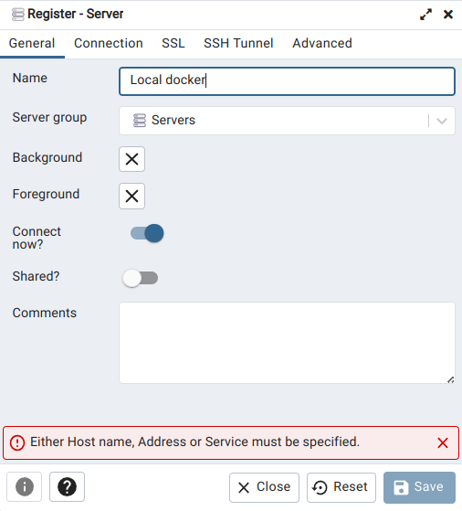
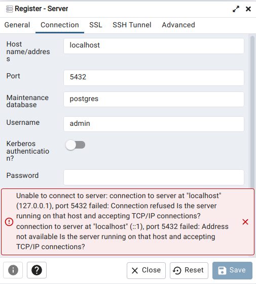
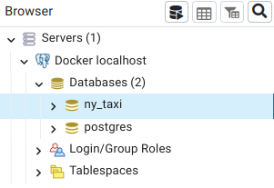
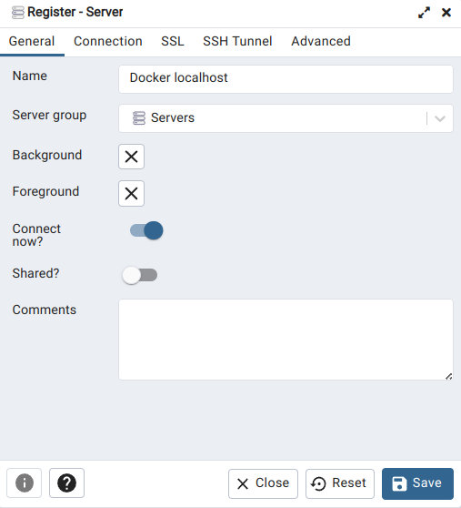
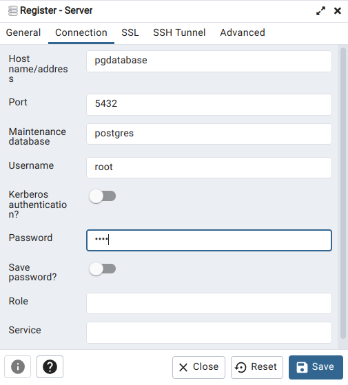

## Week 1 Overview

* [DE Zoomcamp 1.2.1 - Introduction to Docker](#de-zoomcamp-121---introduction-to-docker)
* [DE Zoomcamp 1.2.2 - Ingesting NY Taxi Data to Postgres](#de-zoomcamp-122---ingesting-ny-taxi-data-to-postgres)
* [DE Zoomcamp 1.2.3 - Connecting pgAdmin and Postgres](#de-zoomcamp-123---connecting-pgadmin-and-postgres)
* [DE Zoomcamp 1.2.4 - Dockerizing the Ingestion Script](#de-zoomcamp-124---dockerizing-the-ingestion-script)
* [DE Zoomcamp 1.2.5 - Running Postgres and pgAdmin with Docker-Compose](#de-zoomcamp-125---running-postgres-and-pgadmin-with-docker-compose)
* [DE Zoomcamp 1.2.6 - SQL Refreshser](#de-zoomcamp-126---sql-refreshser)
* [DE Zoomcamp 1.3.1 - Introduction to Terraform Concepts & GCP Pre-Requisites](#de-zoomcamp-131---introduction-to-terraform-concepts--gcp-pre-requisites)
* [DE Zoomcamp 1.3.2 - Creating GCP Infrastructure with Terraform](#de-zoomcamp-132---creating-gcp-infrastructure-with-terraform)
* [Learning in public (LinkedIn)](https://www.linkedin.com/posts/victor-padilha_dataengineering-dataanalytics-dezoomcamp-activity-7023252179117350912-Ch-d?utm_source=share&utm_medium=member_desktop)

## [DE Zoomcamp 1.2.1 - Introduction to Docker](https://www.youtube.com/watch?v=EYNwNlOrpr0&list=PL3MmuxUbc_hJed7dXYoJw8DoCuVHhGEQb)

### What is Docker?

Docker is a tool that delivers software in containers, which are isolated from each other, and contain all code and dependencies required to run some service or task (e.g., data pipeline).

Docker has several advantages:
1. It is easy to reproduce data pipelines in different environments.
2. We can run local experiments and local tests, such as integration tests.
3. It is useful to perform integration tests under CI/CD.
4. We can deploy pipelines in the cloud (e.g., AWS Batch and Kubernetes jobs).
5. We can process data using Serverless services (e.g., AWS Lambda).

## [DE Zoomcamp 1.2.2 - Ingesting NY Taxi Data to Postgres](https://www.youtube.com/watch?v=2JM-ziJt0WI&list=PL3MmuxUbc_hJed7dXYoJw8DoCuVHhGEQb)

**Step 1:** pull the PostgreSQL docker image that we will use throughout the zoomcamp.
```
docker pull postgres:13
```

**Step 2:** Create a folder called ny_taxi_postgres_data which will be your "volume" where you keep your persistent data. 
**Step 3:** create and run an empty database. $pwd is a way to pass current working directory to the command line through variable assignment.
```
docker run -it \
    -e POSTGRES_USER="root" \
    -e POSTGRES_PASSWORD="root" \
    -e POSTGRES_DB="ny_taxi" \
    -v $(pwd)/ny_taxi_postgres_data:/var/lib/postgresql/data \
    -p 5432:5432 \
    postgres:13
```

**Step 3:** we can access the empty database in another terminal as follows. If you type ```\dt```, you can see that our database is still empty.
```
pgcli -h localhost -p 5432 -u root -d ny_taxi
```

**Step 4:** Go to Week1_Docker_Terraform folder. download the NYC taxi dataset.
```
cd Week1_Docker_Terraform
wget https://d37ci6vzurychx.cloudfront.net/trip-data/yellow_tripdata_2021-01.parquet
```

## [DE Zoomcamp 1.2.3 - Connecting pgAdmin and Postgres](https://www.youtube.com/watch?v=hCAIVe9N0ow&list=PL3MmuxUbc_hJed7dXYoJw8DoCuVHhGEQb)


**Step 1:** basic exploration of our dataset, to check if our results matches the ones presented in the lesson.
```sql
SELECT count(1) from yellow_taxi_data;

SELECT max(tpep_pickup_datetime), min(tpep_pickup_datetime), max(total_amount) FROM yellow_taxi_data;
```

**Step 2:** pull pgadmin's docker image and run it.
```
docker pull dpage/pgadmin4

docker run -it \
    -e PGADMIN_DEFAULT_EMAIL="admin@admin.com" \
    -e PGADMIN_DEFAULT_PASSWORD="root" \
    -p 8080:80 \
    dpage/pgadmin4
```

**Step 3:** access pgadmin thorugh localhost:8080 in the browser. After logging in, we can create a new server (right click Servers -> Register -> Server), as follows:





Note that we are unable to connect to server at localhost. This problem happens, because localhost refers to the pgadmin's container (remember that we are running pgadmin and Postgres in different containers). For such, we need to create a network and specify it in the docker run commands, to allow the containers to see each other.

```
docker network create pg-network

docker run -it \
    -e POSTGRES_USER="root" \
    -e POSTGRES_PASSWORD="root" \
    -e POSTGRES_DB="ny_taxi" \
    -v $(pwd)/ny_taxi_postgres_data:/var/lib/postgresql/data \
    -p 5432:5432 \
    --network=pg-network \
    --name=pg-database \
    postgres:13

docker run -it \
    -e PGADMIN_DEFAULT_EMAIL="admin@admin.com" \
    -e PGADMIN_DEFAULT_PASSWORD="root" \
    -p 8080:80 \
    --network=pg-network \
    --name=pgadmin \
    dpage/pgadmin4
```

And now, we are able to create the server using pgadmin's interface.




## [DE Zoomcamp 1.2.4 - Dockerizing the Ingestion Script](https://www.youtube.com/watch?v=B1WwATwf-vY&list=PL3MmuxUbc_hJed7dXYoJw8DoCuVHhGEQb&index=8)


Then, dockerize the ingestion script (see [Dockerfile](./Dockerfile)), build and run the container.
```
docker build -t taxi_ingest:v001 .

docker run -it \
    --network=week1_docker_terraform_default \
    taxi_ingest:v001 \
    --user=root \
    --password=root \
    --host=pgdatabase \
    --port=5432 \
    --db=ny_taxi \
    --table_name=yellow_taxi_trips \
    --url=${URL}
```

## [DE Zoomcamp 1.2.5 - Running Postgres and pgAdmin with Docker-Compose](https://www.youtube.com/watch?v=hKI6PkPhpa0&list=PL3MmuxUbc_hJed7dXYoJw8DoCuVHhGEQb&index=9)

Docker compose allows us to run multi-container docker applications, by specifying a number of services that must be run together in a single YAML file. For more information, see [docker docs](https://docs.docker.com/compose/).

**Step 1:** write a [docker-compose.yaml](./docker-compose.yaml) file. Note that in this file we do not specify the network name, since docker compose will already consider the specified services as part of the same network. It will automatically put all the 'services' (aka containers) into a network with the name of the directory_default. 

**Step 2:** start docker compose.
```
docker compose up
```

**Step 3:** create the server using pgadmin's interface.





**Step 4:** to stop the process, just use ```Ctrl C``` and the command:
```
docker compose down
```

**Step 5:** if we want to run docker compose in detached mode, we can run the following command:
```
docker compose up -d
```

## [DE Zoomcamp 1.2.6 - SQL Refreshser](https://www.youtube.com/watch?v=QEcps_iskgg&list=PL3MmuxUbc_hJed7dXYoJw8DoCuVHhGEQb&index=10)

In this video, Alexey Grigorev reviews some simple SQL statements that we can use to perform joins, group by, order by, etc. Below, I just compiled a few of them, since the rest consist of some small variations to illustrate the concepts he talks about.

**Step 1:** run [ingest_taxi_zone_lookup.py](./ingest_taxi_zone_lookup.py), which downloads Taxi Zone Lookup Table and ingests the data to the ny_taxi database.
```
docker compose up
python ingest_taxi_zone_lookup.py
```

**Step 2:** checking the records of zones and yellow_taxi_trips.
```sql
SELECT * FROM zones;
SELECT * FROM yellow_taxi_trips LIMIT 100;
```

**Step 3:** two ways of performing an inner join. Here, we want to list the pickup location, dropoff location, total amount paid by the passengers, pickup time and dropoff time.

```sql
SELECT
	tpep_pickup_datetime,
	tpep_dropoff_datetime,
	total_amount,
	CONCAT(zpu."Borough", ' / ', zpu."Zone") AS "pickup_loc",
	CONCAT(zdo."Borough", ' / ', zdo."Zone") AS "dropoff_loc"
FROM
	yellow_taxi_trips t,
	zones zpu,
	zones zdo
WHERE
	t."PULocationID" = zpu."LocationID" AND
	t."DOLocationID" = zdo."LocationID"
LIMIT 100;

SELECT
	tpep_pickup_datetime,
	tpep_dropoff_datetime,
	total_amount,
	CONCAT(zpu."Borough", ' / ', zpu."Zone") AS "pickup_loc",
	CONCAT(zdo."Borough", ' / ', zdo."Zone") AS "dropoff_loc"
FROM
	yellow_taxi_trips t
	JOIN zones zpu ON t."PULocationID" = zpu."LocationID"
	JOIN zones zdo ON t."DOLocationID" = zdo."LocationID"
LIMIT 100;
```

**Step 4:** checking for empty values in PULocationID or DOLocationID. Both queries return empty results.
```sql
SELECT
	tpep_pickup_datetime,
	tpep_dropoff_datetime,
	total_amount,
	"PULocationID",
	"DOLocationID"
FROM
	yellow_taxi_trips t
WHERE
	"PULocationID" is NULL OR
	"DOLocationID" is NULL;
```

**Step 5:** checking if there is any pickup or dropoff location id in yellow_taxi_trips that does not exist in zones. This query returns an empty result.
```sql
SELECT
	tpep_pickup_datetime,
	tpep_dropoff_datetime,
	total_amount,
	"PULocationID",
	"DOLocationID"
FROM
	yellow_taxi_trips t
WHERE
	"PULocationID" NOT IN (SELECT "LocationID" from zones) OR
	"DOLocationID" NOT IN (SELECT "LocationID" from zones);
```

**Step 6:** deleting LocationID = 142 from zones, and rewriting the inner join query as a left join query (i.e., returning all records from the left table and the intersection with the second table).
```sql
DELETE FROM zones WHERE "LocationID" = 142;

SELECT
	tpep_pickup_datetime,
	tpep_dropoff_datetime,
	total_amount,
	"PULocationID",
	"DOLocationID"
FROM
	yellow_taxi_trips t
WHERE
	"PULocationID" NOT IN (SELECT "LocationID" from zones);

SELECT
	tpep_pickup_datetime,
	tpep_dropoff_datetime,
	total_amount,
	CONCAT(zpu."Borough", ' / ', zpu."Zone") AS "pickup_loc",
	CONCAT(zdo."Borough", ' / ', zdo."Zone") AS "dropoff_loc"
FROM
	yellow_taxi_trips t
	LEFT JOIN zones zpu ON t."PULocationID" = zpu."LocationID"
    LEFT JOIN zones zdo ON t."DOLocationID" = zdo."LocationID"
LIMIT 100;
```

## [DE Zoomcamp 1.3.1 - Introduction to Terraform Concepts & GCP Pre-Requisites](https://www.youtube.com/watch?v=Hajwnmj0xfQ&list=PL3MmuxUbc_hJed7dXYoJw8DoCuVHhGEQb&index=11)

### What is Terraform?

It is an open source project by HashiCorp, which is used for provisioning infrastructure resources through a set of configuration files. The resources can be storage, containers, networking resources, etc.

Terraform uses an Infrastructure-as-Code (IaC) approach, that supports DevOps best practices to track changes in the cloud infrastructure used by an application.

IaC allows us to build, change and manage an application infrastructure using configuration files that can be versioned, reused and shared. This allows any data engineer to reproduce all steps performed to build the infrastructure.

**How to install Terraform (Ubuntu):** follow [these instructions](https://developer.hashicorp.com/terraform/tutorials/aws-get-started/install-cli).

### Google Cloud Platform (GCP)

In this part, Sejal Vaidya shows us how to create a new project in GCP and a new service account. A service account consists of an account for a specific services (like a data pipeline, web service, etc). Everything that this service needs to access (e.g., resources) is configured in its account. Therefore, it has restricted permissions to use only the resources that it needs.

**How to install Gcloud (Ubuntu):** follow [these instructions](https://cloud.google.com/sdk/docs/install#deb). After installing, type ```gcloud -v``` in the terminal. The output must be something like this:

	Google Cloud SDK 414.0.0
	alpha 2023.01.13
	beta 2023.01.13
	bq 2.0.84
	bundled-python3-unix 3.9.16
	core 2023.01.13
	gcloud-crc32c 1.0.0
	gsutil 5.18

**Step 1:** after creating a service account key (watch lesson video at [10:29](https://www.youtube.com/watch?v=Hajwnmj0xfQ&list=PL3MmuxUbc_hJed7dXYoJw8DoCuVHhGEQb&index=11&t=629s)), we need to export the GOOGLE_APPLICATION_CREDENTIALS variable (change the path below to the correct one in your machine).
```
export GOOGLE_APPLICATION_CREDENTIALS="~/Repositories/google_credentials.json"

# Refresh token, and verify authentication
gcloud auth application-default login
```

**Step 2:** add permissions to our service account (watch lesson video at [17:26](https://www.youtube.com/watch?v=Hajwnmj0xfQ&list=PL3MmuxUbc_hJed7dXYoJw8DoCuVHhGEQb&index=11&t=1046s)).

## [DE Zoomcamp 1.3.2 - Creating GCP Infrastructure with Terraform](https://www.youtube.com/watch?v=dNkEgO-CExg&list=PL3MmuxUbc_hJed7dXYoJw8DoCuVHhGEQb&index=12)

**Step 1:** initialize terraform and install any required plugins and settings. After running the command below, the .terraform directory is created.
```
terraform init
```

**Step 2:** run planning, which outputs what Terraform is going to create or modify in our infrastructure (note that it will not apply anything, it just shows us what is going to be done if we decide to apply the changes). This command will ask us to inform the gcp project id variable.
```
terraform plan
```

**Step 3:** apply the changes.
```
terraform apply
```

The output of the terraform apply command must be something similar to:

	google_bigquery_dataset.dataset: Creating...
	google_storage_bucket.data-lake-bucket: Creating...
	google_bigquery_dataset.dataset: Creation complete after 2s [id=projects/dtc-de-375514/datasets/trips_data_all]
	google_storage_bucket.data-lake-bucket: Creation complete after 4s [id=dtc_data_lake_dtc-de-375514]

	Apply complete! Resources: 2 added, 0 changed, 0 destroyed.